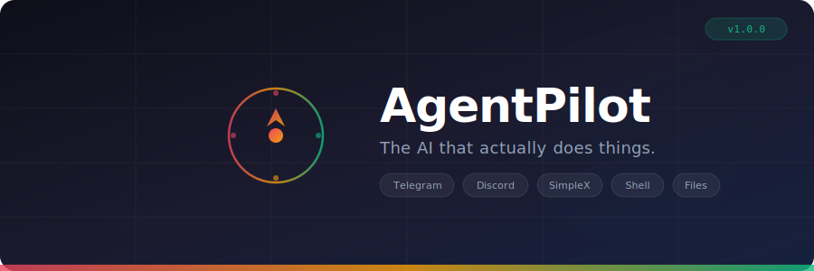

<p align="center">
  
</p>

<p align="center">
  <strong>Self-hosted AI assistant that connects to your messaging apps and takes real actions on your machine.</strong>
</p>

<p align="center">
  
  
  
  
  
</p>

<p align="center">
  <a href="#quickstart">Quickstart</a> &nbsp;&bull;&nbsp;
  <a href="#what-can-it-do">What Can It Do</a> &nbsp;&bull;&nbsp;
  <a href="#architecture">Architecture</a> &nbsp;&bull;&nbsp;
  <a href="docs/USER_GUIDE.md">User Guide</a> &nbsp;&bull;&nbsp;
  <a href="#dashboard">Dashboard</a>
</p>

---

## Why AgentPilot?

Most AI chatbots just talk. AgentPilot **does things**.

Send a message on Telegram and your agent will browse the web, create files, run shell commands, manage notes, and send emails &mdash; all from your own machine, under your control.

No cloud lock-in. No subscription fees beyond your AI API key. No data leaving your machine unless you tell it to.

| Feature | AgentPilot | Cloud AI Assistants |
|---------|:---:|:---:|
| Runs on your machine | :white_check_mark: | :x: |
| Full filesystem access | :white_check_mark: | :x: |
| Shell command execution | :white_check_mark: | :x: |
| Multi-channel (Telegram, Discord, SimpleX) | :white_check_mark: | :x: |
| Permission system with audit trail | :white_check_mark: | :x: |
| No monthly subscription | :white_check_mark: | :x: |
| Open source | :white_check_mark: | :x: |

## Quickstart

```bash
# Clone
git clone https://github.com/salvadalba/nodaysidle-bordonumri.git agentpilot
cd agentpilot

# Install dependencies
pnpm install

# Run setup (creates config, database)
./scripts/setup.sh

# Add your Anthropic API key + Telegram bot token
nano ~/.agentpilot/config.json

# Start the gateway
pnpm dev
```

The gateway starts on `http://localhost:3100`. Send a message to your Telegram bot and watch it work.

> **Need a step-by-step walkthrough?** Check the [User Guide](docs/USER_GUIDE.md).

## What Can It Do

### :globe_with_meridians: Web Browsing
```
"Search for the latest Node.js release"
"Browse https://news.ycombinator.com and summarize the top stories"
```

### :file_folder: File Management
```
"Create a file called todo.txt with my shopping list"
"Read the contents of ~/.zshrc"
"Delete ~/Downloads/temp.log"
```

### :computer: Shell Commands
```
"How much disk space do I have left?"
"List all running Docker containers"
"Run npm test in my project folder"
```

### :memo: Notes
```
"Create a note called ideas with my app concepts"
"Append 'buy milk' to my groceries note"
"Search my notes for anything about passwords"
```

### :email: Email
```
"Send an email to bob@example.com about the meeting tomorrow"
```
> Emails require confirmation before sending &mdash; the bot will ask you to reply "yes" first.

## Architecture

```
                    +------------------+
                    |   You (Phone)    |
                    +--------+---------+
                             |
              +--------------+--------------+
              |              |              |
        +-----+----+  +-----+----+  +------+-----+
        | Telegram |  | Discord  |  |  SimpleX   |
        +-----+----+  +-----+----+  +------+-----+
              |              |              |
              +--------------+--------------+
                             |
                    +--------v---------+
                    |  Gateway Server  |
                    |  (Fastify 5)     |
                    +--------+---------+
                             |
                    +--------v---------+
                    |  Agent Engine    |
                    |  (Tool Loop)     |
                    +--------+---------+
                             |
              +--------------+--------------+
              |              |              |
        +-----v----+  +-----v----+  +------v-----+
        |  Claude  |  | Permis-  |  |   Action   |
        | Haiku 3.5|  |  sion    |  |  Workers   |
        |          |  |  Guard   |  |            |
        +----------+  +----------+  +------+-----+
                                           |
                          +----------------+----------------+
                          |        |        |       |       |
                        Shell    Files   Browser  Notes   Email
```

**Turborepo monorepo** with 6 packages + 2 apps:

| Package | Purpose |
|---------|---------|
| `packages/core` | Shared types, config loader, error classes |
| `packages/db` | SQLite + Drizzle ORM (sessions, messages, audit) |
| `packages/ai` | Claude + Gemini adapters with tool-calling |
| `packages/permissions` | 5-level permission guard with per-channel scoping |
| `packages/actions` | Action workers: browser, email, files, notes, shell |
| `packages/channels` | Telegram (grammY), Discord (discord.js), SimpleX adapters |
| `apps/gateway` | Fastify server, agent engine, REST API, WebSocket |
| `apps/dashboard` | Next.js 15 glassmorphism control panel |

## Security

AgentPilot uses a **5-level permission system** to control what the bot can do per channel and per user:

| Level | Name | Capabilities |
|:-----:|------|-------------|
| 0 | ReadOnly | Browse web, search, read files |
| 1 | Communicate | Send emails and messages |
| 2 | Modify | Create, edit, delete files and notes |
| 3 | Execute | Run shell commands |
| 4 | Admin | Full access to everything |

- **Per-channel scoping** &mdash; Telegram can have Execute while Discord stays ReadOnly
- **Per-user overrides** &mdash; Give specific users higher access within a channel
- **Confirmation prompts** &mdash; Destructive actions (email sends) require you to reply "yes"
- **Full audit trail** &mdash; Every action, input, output, and permission check is logged

## Dashboard

The web dashboard provides real-time monitoring of your agent:

- **Live activity feed** via WebSocket &mdash; see thinking, actions, and responses in real-time
- **Audit log viewer** &mdash; browse the full history of everything the agent has done
- **System status** &mdash; channel connections, AI provider status, database health
- **Settings** &mdash; configure gateway URL, view current config

> **Hosted dashboard:** [dashboard-nodaysidle.vercel.app](https://dashboard-nodaysidle.vercel.app) (connect it to your local gateway via Settings)

## Configuration

Edit `~/.agentpilot/config.json`:

```jsonc
{
  "ai": {
    "primary": "anthropic",           // "anthropic" or "gemini"
    "anthropicApiKey": "sk-ant-...",
    "geminiApiKey": "AIza..."         // optional fallback
  },
  "channels": {
    "telegram": { "botToken": "123456:ABC..." },
    "discord": { "botToken": "MTIz..." },
    "simplex": { "cliPath": "/usr/local/bin/simplex-chat" }
  },
  "permissions": {
    "defaultLevel": 3,                // 0-4, see table above
    "channelOverrides": {}
  },
  "server": {
    "port": 3100,
    "host": "127.0.0.1"
  }
}
```

## Tech Stack

| Layer | Technology |
|-------|-----------|
| Runtime | Node.js 22+, TypeScript 5.7 |
| Monorepo | Turborepo + pnpm workspaces |
| Server | Fastify 5 with WebSocket |
| Database | SQLite via better-sqlite3 + Drizzle ORM |
| AI | Claude Haiku 3.5 (primary), Gemini Flash (fallback) |
| Channels | grammY, discord.js, simplex-chat CLI |
| Browser | Playwright |
| Dashboard | Next.js 15, React 19, Framer Motion |
| Testing | Vitest &mdash; 120 tests across 18 test files |

## Development

```bash
pnpm install          # Install dependencies
pnpm turbo test:unit  # Run all 120 tests
pnpm dev              # Start gateway + dashboard
pnpm build            # Production build
```

## API

| Method | Path | Description |
|--------|------|-------------|
| `GET` | `/health` | Gateway status, version, channels |
| `GET` | `/api/config` | Config overview (secrets redacted) |
| `GET` | `/api/channels` | Connected channel adapters |
| `GET` | `/api/audit?limit=N` | Audit log entries |
| `WS` | `/ws` | Real-time events (thinking, action, response, error) |

## License

MIT

---

<p align="center">
  <sub>Every action logged. Every permission checked. Your machine, your rules.</sub>
</p>
